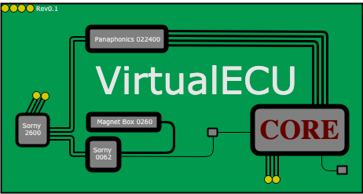

# VirtualEcu Core

  

VirtualEcu Core is an open source project intended to learn the basic aspects of object-oriented programming using Java.

As the name suggests, the domain model we're going to develop through this project is a ficticious ECU (engine control unit), which is an embedded device in any modern car. So that we're going to model a simplification of topics such as the management of different kinds of sensors, fuel injection measurement and air/fuel relationship calculation, among other things. Don't worry! Knowledge in automotive mechanic is not required.

From the implementation perspective, this is a maven project which includes a java console application and shows static information regarding the settings of the ECU components. In the near future we're going to add new features which will make possible to run the ECU dynamically and to adjust the engine attributes in real time. Also, we would like to add secondary projects which depend on this one, such as a graphic dashboard simulating product like Tunner Studio. That's the reason why we named this project using "core" at the end: We expect to count with projects such as VirtualEcu Web Dashboard, VirtualEcu Desktop Dashboard and so on.

### Requirements

- Java 8 (If you prefer try with a previous version, we don't use any of the new Java 8 features yet).
- Maven 3.
- An IDE of your choice.

### Content

All the topics included so far are available as branches. You can navigate between them and check out the different features:
(branch description and what the ecu does, what sensors are implemented, etc)